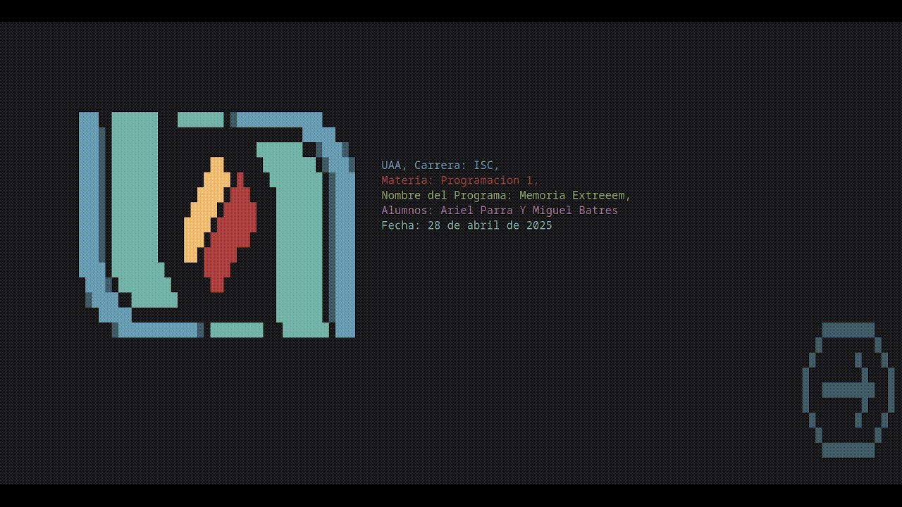

# MemoriaExtreem

**MemoriaExtreem** is a memory game that allows you to load new words, display results in a file, and is compatible with multiple operating systems, including Windows, macOS, Linux, FreeBSD, OpenBSD, and other UNIX-based systems.



> [!IMPORTANT]  
> This project is made completely in spanish, the Code, Menus and on-screen instructions, will be displayed only in **Spanish**.

---

## Features

- **Cross-platform compatibility**: Works on Windows, macOS, Linux, and UNIX-based systems.
- **Customization**: Allows you to load new words to personalize the game.
- **Exportable results**: Saves results to a file for later analysis.
- **Sound effects**: Includes sound effects to enhance the user experience.

---

## Build Requirements

### Windows

1. Install the `gcc` compiler, available through [MSYS2](https://www.msys2.org/).
2. To compile with the included icon, run the `Compilar_Con_ICONO.bat` script by double-clicking on it.

### Linux/macOS

1. Install the required libraries:
   - **Debian/Ubuntu**: `sudo apt install libncurses5 libncurses5-dev`
   - **Fedora**: `sudo dnf install ncurses ncurses-devel`
   - **Arch Linux**: `sudo pacman -S ncurses`
2. Compile the project by running the following command in the terminal:

   ```bash
   make
   ```

## Sound Effects

The game includes several sound effects to enhance the user experience. These are the resources used:

- **`pop.wav`**: Retrieved from [SoundBible](https://soundbible.com/2067-Blop.html).
- **`error.wav` y `exito.wav`**: Generated with [sfxr.me](https://sfxr.me/).
- **`song.wav`**: Retrieved from "BossMain.wav" on [OpenGameArt](https://opengameart.org/content/nes-shooter-music-5-tracks-3-jingles).
- **`win.wav`**: Retrieved from "Victory.wav" on [OpenGameArt](https://opengameart.org/content/victory).