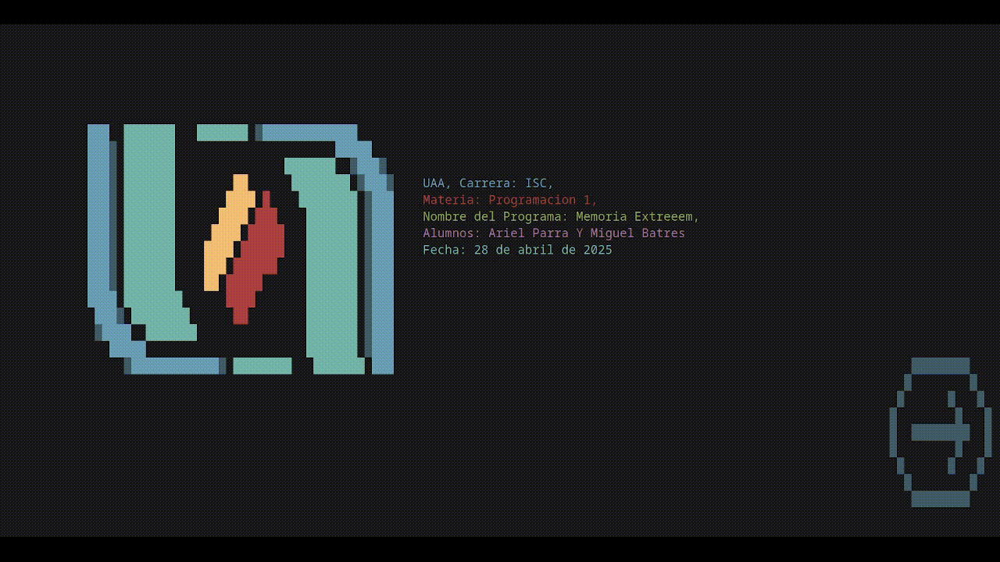

# MemoriaExtreem

**MemoriaExtreem** es un juego de memorama que permite cargar nuevas palabras, mostrar resultados en un archivo y es compatible con múltiples sistemas operativos, incluyendo Windows, macOS, Linux, FreeBSD, OpenBSD y otros sistemas basados en UNIX.



---

## Características

- **Compatibilidad multiplataforma**: Funciona en Windows, macOS, Linux y sistemas basados en UNIX.
- **Personalización**: Permite cargar nuevas palabras para personalizar el juego.
- **Resultados exportables**: Guarda los resultados en un archivo para su análisis posterior.
- **Efectos de sonido**: Incluye efectos de sonido para mejorar la experiencia del usuario.

---

## Requisitos de compilación

### Windows

1. Instala el compilador `gcc`, disponible a través de [MSYS2](https://www.msys2.org/).
2. Para compilar con el ícono incluido, ejecuta el script `Compilar_Con_ICONO.bat` haciendo doble clic sobre él.

### Linux/macOS

1. Instala las librerías necesarias:
   - **Debian/Ubuntu**: `sudo apt install libncurses5 libncurses5-dev`
   - **Fedora**: `sudo dnf install ncurses ncurses-devel`
   - **Arch Linux**: `sudo pacman -S ncurses`
2. Compila el proyecto ejecutando el siguiente comando en la terminal:

   ```bash
   make
   ```

## Efectos de sonido

El juego incluye varios efectos de sonido para mejorar la experiencia del usuario. Estos son los recursos utilizados:

- **`pop.wav`**: Recuperado de [SoundBible](https://soundbible.com/2067-Blop.html).
- **`error.wav` y `exito.wav`**: Generados con [sfxr.me](https://sfxr.me/).
- **`song.wav`**: Recuperado de "BossMain.wav" en [OpenGameArt](https://opengameart.org/content/nes-shooter-music-5-tracks-3-jingles).
- **`win.wav`**: Recuperado de "Victory.wav" en [OpenGameArt](https://opengameart.org/content/victory).